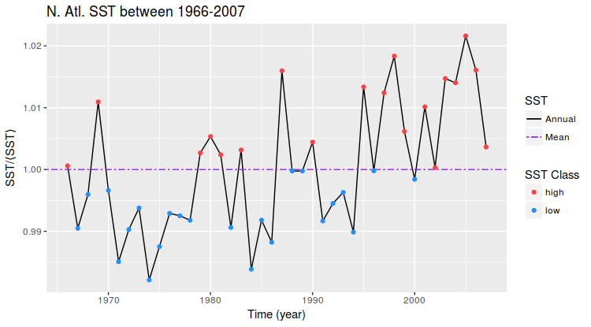

# Tropical-cyclones

My bachelor's thesis (with [Alvaro Corral](http://www.crm.cat/en/About/People/Researchers/acorral/Pages/PersonalContact.aspx?ItemId=CO000207) as my thesis supervisor) consists of the study of hurricanes; both statistical and real occurrences, and comparison with some simple model of self-organized criticality. 

The scripts are used to replicate the analyses and figures from *Scaling of tropical-cyclone dissipation* [1].

## Summary of the analysis

Outline of the procedure used in the paper, and thus my bachelor's thesis.

### Storm track
Hurricane Katrina is selected as an illustration of the calculation of the PDI.

### PDI statistics
The large-scale application of the same calculation yields the PDI probability density.

### Climate analysis
Separating years of high and low sea surface temperature, for example, splits the probability density into two contributions, shown here for the North Atlantic.

## References

[1] : Osso, A., Corral, A., & Llebot, J. E. (2009). *Scaling of Tropical-Cyclone Dissipation*. Nature Physics, 6(9), 693–696. https://doi.org/10.1038/nphys1725
